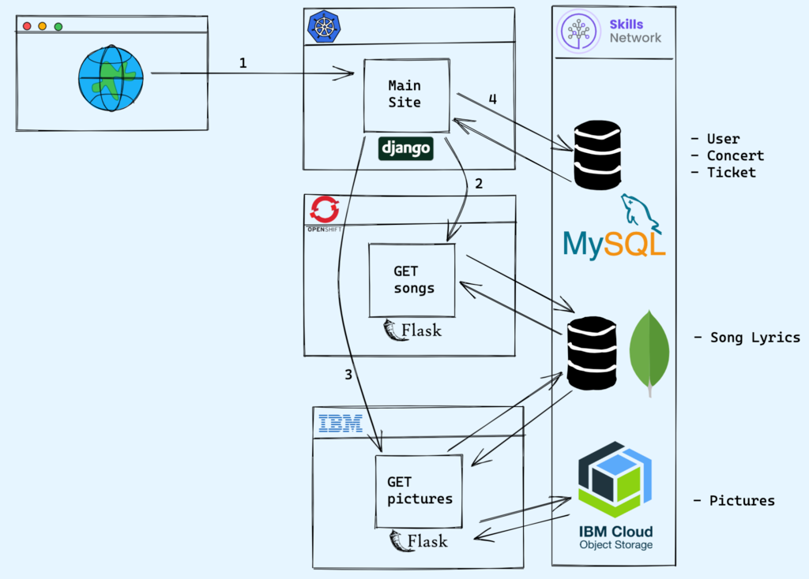

# Projeto de conclusão de curso de desenvolvimento de aplicativos back-end IBM 

site para uma banda de música popular. Os fãs da banda e outros usuários poderão realizar as seguintes ações no site:

- Ver fotos de eventos anteriores

- Ver letras de músicas populares

- Ver uma lista dos próximos eventos

- Criar uma conta

- Entrar e registrar-se em um evento

- Faça login e veja registros anteriores

**Etapas do Capstone**

Para concluir o projeto com êxito, o senhor seguirá as seguintes etapas:

1. Criar o microsserviço Get Pictures no Flask  

a. Criar pontos de extremidade CRUD para a imagem como um recurso.   
b. Criar um endpoint de saúde para o microsserviço.

2. Criar o microsserviço Get Songs no Flask 

a. Configure o banco de dados MongoDB.  

b. Implemente o serviço para recuperar letras de músicas do banco de dados.  

c. Criar um endpoint de saúde para o microsserviço.

3. Criar o aplicativo principal no Django  

a. Crie o modelo de show.

b. Use o modelo de usuário integrado do Django.  

c. Migrar o modelo para criar tabelas no banco de dados SQLite. 

d. Implemente controladores para enviar dados a modelos predefinidos.

4.  Implantar os serviços e o aplicativo  

a. Implante o Get Pictures no IBM Code Engine.

b. Implantar o Get Songs e o MongoDB no Redhat OpenShift.  

c. Implantar o aplicativo principal no serviço IBM Kubernetes.

Será solicitado que o senhor faça capturas de tela durante todo o capstone para enviar para análise dos colegas. Também será solicitado que o senhor revise os envios de seus colegas.

**Arquitetura do Capstone**

1. O usuário visita a página inicial do site Django.

Casos de uso anônimos

2. A página de músicas mostra músicas e letras.

3. A página de fotos mostra fotos de shows anteriores.

Casos de uso do administrador

4. Permitir que o usuário administrador altere a data do show.

Casos de uso de login

- O usuário faz login no aplicativo.
- O usuário pode ver seus concertos.
- O usuário pode reservar um show.
- O usuário pode excluir sua reserva.  

**Critérios de avaliação**

Há um total de 40 pontos possíveis para todos os testes avaliados, divididos entre os quatro módulos do curso.

Há um total de 60 pontos possíveis para o projeto final.

- Módulo 1: Primeiros passos (10 pts)
- módulo 2: Criando o serviço Get Songs com o Flask (10 pts)
- módulo 3: Aplicativo Django principal (10 pts)
- módulo 4: Implantar seu aplicativo e serviços (30 pts)
